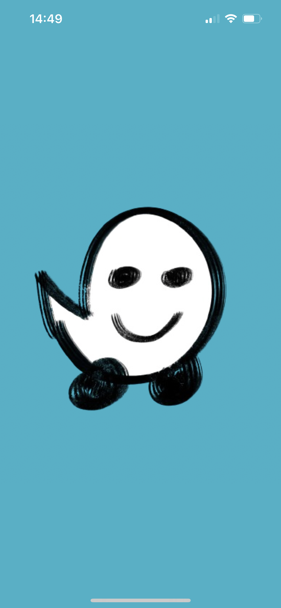
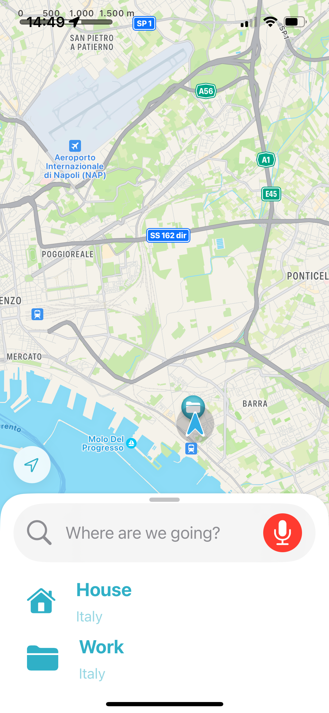
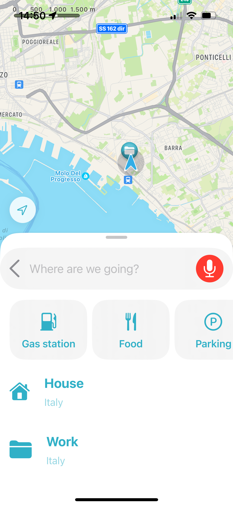
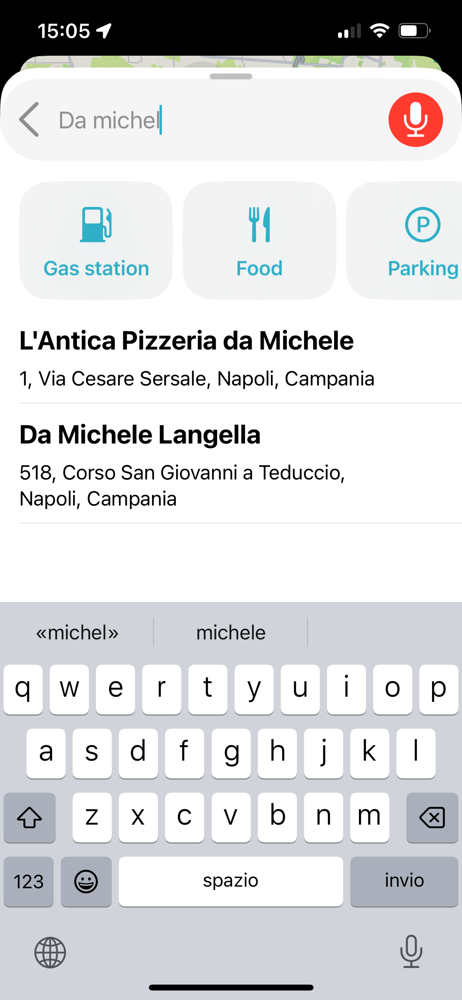
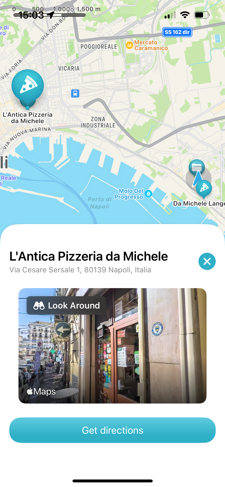
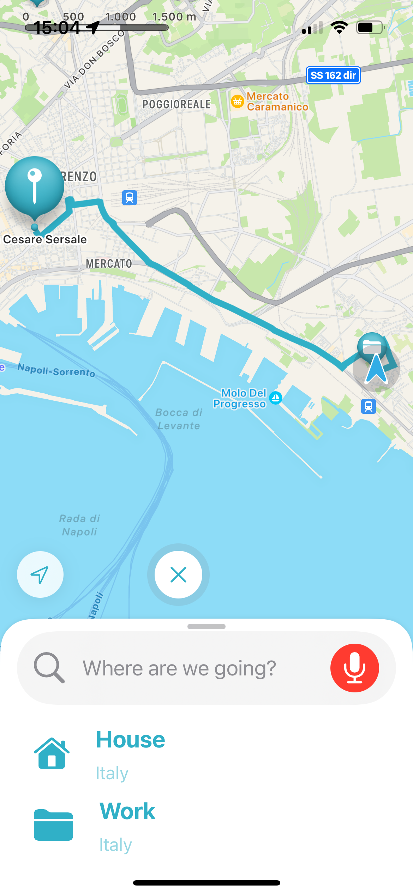

# SwiftUI MapKit Integration

## Overview

This project was born out of a desire to delve deeper into MapKit integration within SwiftUI, particularly exploring the latest functionalities introduced at WWDC23. Inspired by the user interface of navigation apps like Waze, the aim was to create an interactive map experience while incorporating the new Lookaround feature to add a personal touch.

## Refined Challenge Statement

The refined challenge statement encapsulates the essence of this project:
The project involves developing screens inspired by Waze to deepen my understanding of MapKit, leveraging the new functionalities introduced at WWDC23 for MapKit in SwiftUI. The primary goals include learning to display markers on the map, enabling users to select them, and facilitating navigation to the chosen destinations. Additionally, the project incorporates a personal touch with the integration of the new Lookaround feature, aiming to enhance the functionality and contribute a unique element to the real app.

## Development Journey

During the development process, I encountered challenges due to the novelty of the features. Information and documentation were scarce, with only a few projects demonstrating static implementations. However, this presented an opportunity for exploration and experimentation, pushing me to think creatively and problem-solve effectively.

## Code Quality

I acknowledge that there's room for improvement in terms of code cleanliness and readability. As I navigated through unfamiliar territory, some parts may not adhere to best practices. Nonetheless, I'm committed to continuous learning and refinement.

## Key Features

- **Map Display**: Utilizes SwiftUI's integration with MapKit to display an interactive map.
- **Marker Selection**: Enables users to select markers on the map, enhancing interactivity.
- **Navigation Integration**: Facilitates navigation to selected destinations, mimicking real-world navigation apps.
- **Lookaround Feature**: Personalizes the experience with the integration of the new Lookaround feature, adding a unique touch.

## Project Presentation

This project was entirely built using SwiftUI and showcases the capabilities introduced in the latest WWDC23. While the journey may have been challenging, I'm excited to share this project and hope it serves as a valuable resource for fellow developers.
## Final Product
      

Feel free to explore the code and experiment with it. Your feedback and suggestions are always appreciated!

🤞🏻 Happy coding! 🚀
